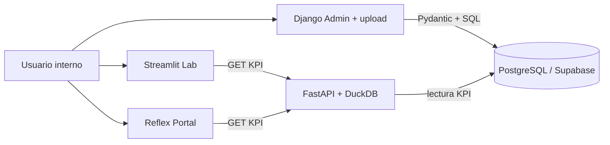

# Ecosistema Insurance Intelligence Hub (demo completa)

Flujo end-to-end que implementa el repositorio:

| Capa | Carpeta / servicio | Rol |
|------|-------------------|-----|
| Ingesta y usuarios | `backend-ingest` (Django) | Login admin, listado de pólizas (solo lectura), **carga CSV/XLSX** persistida en Postgres con `hub-contracts` (sin pasar por la API). |
| Base de datos | Supabase Cloud | Ejecutar `supabase/migrations/001_initial.sql`; `DATABASE_URL` en API y Django. |
| Validación | `shared/` paquete `hub-contracts` | `PolicyRow` (Pydantic) usado en Django (ingesta) y en FastAPI (ingesta opcional vía API). |
| Cómputo | `backend-compute` | KPIs = lectura SQL + agregación **DuckDB** en memoria; fallback sintético. `POST /ingest/policies` opcional (scripts / integraciones). |
| Observabilidad | Loguru + Sentry opcional | `SENTRY_DSN` en la API. |
| Portal | `portal-reflex` | KPIs vía `httpx` → `COMPUTE_API_URL`; botón a carga en Admin (`DJANGO_ADMIN_BASE_URL`). |
| Laboratorio | `lab-streamlit` | Dashboard KPI; enlace a la carga en Django Admin. |

## Variables de entorno clave

| Variable | Dónde | Uso |
|----------|--------|-----|
| `DATABASE_URL` | API, Django | Cadena Postgres (Supabase). |
| `INGEST_API_KEY` | API (opcional) | Si está definida, `POST /api/v1/ingest/policies` exige cabecera `X-API-Key` (uso no operativo típico). |
| `COMPUTE_API_URL` | Reflex, Streamlit | URL pública de la API (p. ej. Render). |
| `DJANGO_ADMIN_BASE_URL` | Reflex, Streamlit (opcional) | Base URL del Admin para enlace a `/admin/upload-policies/` (en Reflex, en nube es necesaria para apuntar al Admin público). |
| `DJANGO_SECRET_KEY` | Django | Secreto de sesión. |
| `ALLOWED_HOSTS` | Django | Incluir el host de despliegue (p. ej. `*.onrender.com` o nombre explícito). |
| `SENTRY_DSN` | API | Opcional. |

## Orden recomendado de despliegue

1. Crear proyecto Supabase y aplicar `001_initial.sql`.
2. Desplegar **API** (`backend-compute`) con `DATABASE_URL`, `INGEST_API_KEY` opcional, `pip install ../shared` en build.
3. Desplegar **Django** (`backend-ingest`) con la misma `DATABASE_URL`, `pip install ../shared` en build; `python manage.py migrate`; crear superusuario.
4. Desplegar **Streamlit Cloud** y **Reflex Cloud** (o contenedor) con `COMPUTE_API_URL`; añade `DJANGO_ADMIN_BASE_URL` en Reflex (y opcional en Streamlit) para el enlace directo a la carga CSV.

Guía rápida gratuita: [`deploy-free-tier.md`](deploy-free-tier.md).
