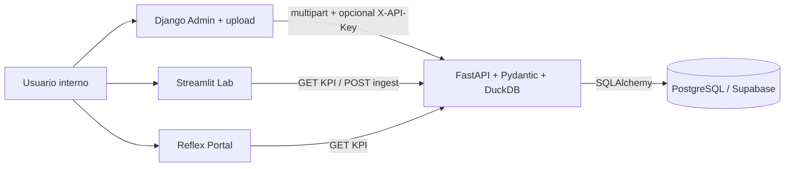

# Ecosistema Insurance Intelligence Hub (demo completa)

Flujo end-to-end que implementa el repositorio:

| Capa | Carpeta / servicio | Rol |
|------|-------------------|-----|
| Ingesta y usuarios | `backend-ingest` (Django) | Login admin, listado de pólizas (solo lectura), **carga CSV/XLSX** reenviada a la API. |
| Base de datos | Supabase Cloud | Ejecutar `supabase/migrations/001_initial.sql`; `DATABASE_URL` en API y Django. |
| Validación | `shared/` paquete `hub-contracts` | `PolicyRow` (Pydantic) usado en FastAPI. |
| Cómputo | `backend-compute` | Ingesta → Postgres; KPIs = lectura SQL + agregación **DuckDB** en memoria; fallback sintético. |
| Observabilidad | Loguru + Sentry opcional | `SENTRY_DSN` en la API. |
| Portal | `portal-reflex` | KPIs vía `httpx` → `COMPUTE_API_URL`. |
| Laboratorio | `lab-streamlit` | Dashboard + **pestaña de carga** hacia la misma API. |

## Variables de entorno clave

| Variable | Dónde | Uso |
|----------|--------|-----|
| `DATABASE_URL` | API, Django | Cadena Postgres (Supabase). |
| `INGEST_API_KEY` | API, Django, Streamlit (opcional) | Si está definida en la API, la ingestión exige cabecera `X-API-Key`. **Misma clave** en todos. |
| `COMPUTE_API_URL` | Django, Reflex, Streamlit | URL pública de la API (p. ej. Render). |
| `DJANGO_SECRET_KEY` | Django | Secreto de sesión. |
| `ALLOWED_HOSTS` | Django | Incluir el host de despliegue (p. ej. `*.onrender.com` o nombre explícito). |
| `SENTRY_DSN` | API | Opcional. |

## Orden recomendado de despliegue

1. Crear proyecto Supabase y aplicar `001_initial.sql`.
2. Desplegar **API** (`backend-compute`) con `DATABASE_URL`, `INGEST_API_KEY`, `pip install ../shared` en build.
3. Desplegar **Django** (`backend-ingest`) con la misma `DATABASE_URL`, `COMPUTE_API_URL` = URL de la API, misma `INGEST_API_KEY`; `python manage.py migrate`; crear superusuario.
4. Desplegar **Streamlit Cloud** y **Reflex Cloud** (o contenedor) con `COMPUTE_API_URL` y secretos de ingestión si aplica.

Guía rápida gratuita: [`deploy-free-tier.md`](deploy-free-tier.md).
